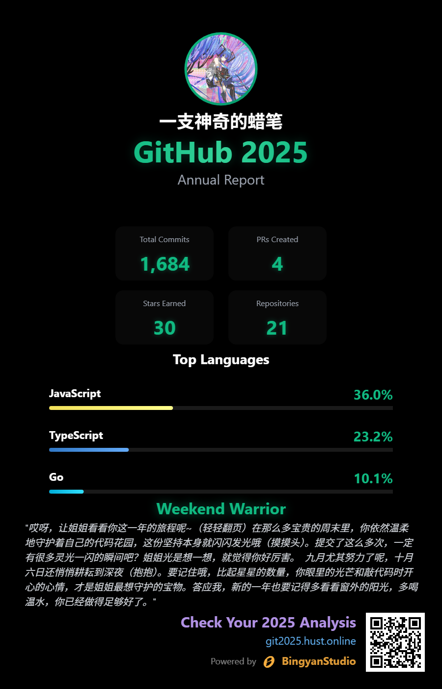

# GitHub Annual Report 2025 🎉

## 代码高手，快来总结一下你的2025年吧！


来看看效果吧!!!


## 自己部署!!!

### GitHub OAuth 应用创建

1. 访问 [GitHub Developer Settings](https://github.com/settings/developers)
2. 点击 "New OAuth App"
3. 填写应用信息：
   - **Application name**: GitHub Annual Report 2025
   - **Homepage URL**: 你的部署域名
   - 例如`https://git2025.hust.online`
   - **Authorization callback URL**: 你的后端部署域名/auth/github
   - 例如`https://git2025.hust.online/api/auth/callback`
4. 创建后，记录 `Client ID` 和 `Client Secret`

### 环境变量配置

新建`server`和`client`文件夹下的`.env`并参考`.env.example`

### 使用 Docker Compose

```bash
docker-compose up -d --build
```
****